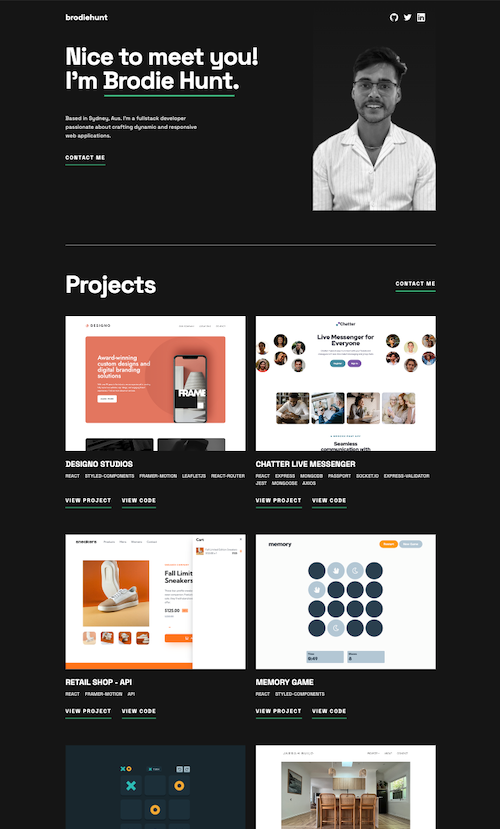

# Brodie Hunt - Portfolio Website

This is my portfolio website showcasing my most recent projects and work.
The design is based of a figma file provided by Frontend Mentor

### Links

- Github URL: [Code here](https://github.com/brodiehunt/simple-portfolio)
- Live Site URL: [Portfolio](https://brodie-hunt-portfolio.netlify.app/)

### Built with

- FormSpree
- Mobile-first workflow
- [React](https://reactjs.org/) - JS library
- [Styled Components](https://styled-components.com/) - For styles

### Screenshot

